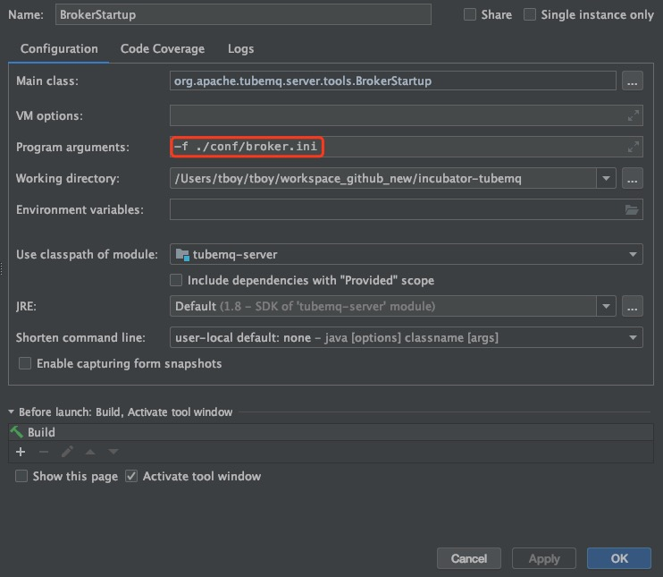

## 搭建本地环境

### 环境
TubeMQ对外部，只有Zookeeper的依赖。Java在1.7/1.8都可以。

### 编译
```
mvn clean install -DskipTests
```  
### 设置Master 
   1. 配置master.ini
     <br>找到conf下的master.ini文件，修改master, zookeeper,  bdbStore三部分。
     - master:
        - hostName = 127.0.0.1
        - webResourcePath = ./resources
     - zookeeper
        - zkServerAddr = localhost:2181
     - bdbStore 
        - bdbEnvHome= ./tubemqMasterGroup/master_data
        - bdbHelperHost = localhost:9001
  2. 配置velocity.properties,定位到102行:
        - file.resource.loader.path=./resources/templates
  3. 修改AddressUtils
     ```
     private static String localIPAddress = "127.0.0.1";
     ```
  4. 增加log4j文件
     <br>在server模块，新增resource目录，添加log4j.properties文件(可以从conf目录下直接复制)。
  5. 启动Master
     <br>Master和Broker的启动类，都在server模块的tools包内。找到MasterStartup, 通过以下两种方式设置启动配置文件:
     - 设置启动参数
       
     - 修改类文件
       ```
       public class MasterStartup {
           public static void main(final String[] args) throws Exception {
               String[] configArgs = new String[]{"-f", "./conf/master.ini"};
               final String configFilePath = ToolUtils.getConfigFilePath(configArgs);
               final MasterConfig masterConfig = ToolUtils.getMasterConfig(configFilePath);
               TMaster master = new TMaster(masterConfig);
               master.start();
               master.join();
           }
       }
       ```
     右键运行MasterStartup。
  6. 添加broker信息
     <br>打开http://localhost:8080/config/broker_list.htm，点击'单个新增'
        
     
     设置'可发布','可订阅'

### 设置Broker
   1. 配置broker.ini
      - hostName = 127.0.0.1
      - masterAddressList = localhost:8000
      - primaryPath = ./stage/metadata_1
   2. 启动Broker
      <br>在server模块的tools包内。找到BrokerStartup, 通过以下两种方式设置启动配置文件:
      - 设置启动参数
      
      - 修改类文件
      ```
      public class BrokerStartup {
          public static void main(final String[] args) throws Exception {
              String[] configArgs = new String[]{"-f", "./conf/broker.ini"};
              final String configFilePath = ToolUtils.getConfigFilePath(configArgs);
              final BrokerConfig tubeConfig = ToolUtils.getBrokerConfig(configFilePath);
              final TubeBroker server = new TubeBroker(tubeConfig);
              server.start();
          }
      }
      ```
   
