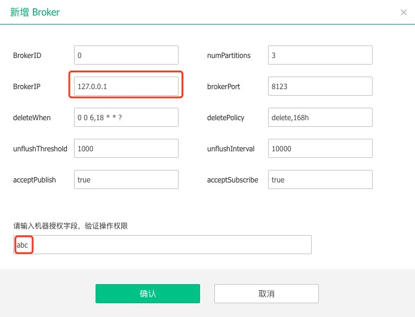
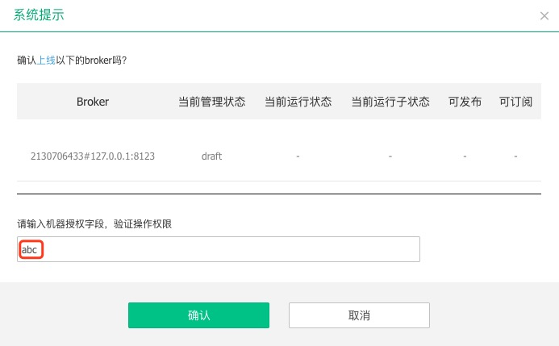
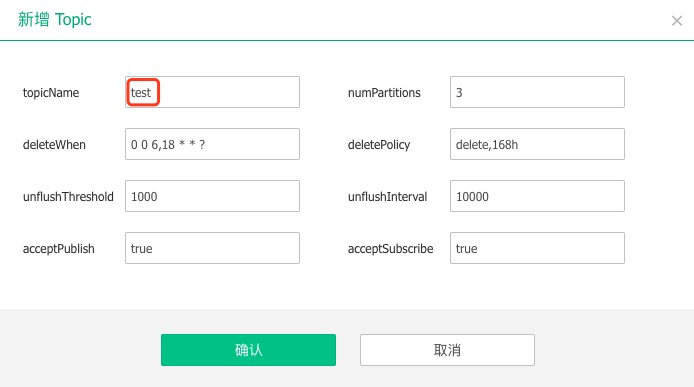

## 搭建本地环境

### 环境
  &nbsp;&nbsp;TubeMQ对外部，只有Zookeeper的依赖。Java在1.7/1.8都可以。

### 编译
   ```
   mvn clean install -DskipTests
   ```  
### 启动Master 
   1. 配置master.ini
      <br>找到conf下的master.ini文件，修改master, zookeeper,  bdbStore三部分。
      - master:
        - hostName = 127.0.0.1
        - webResourcePath = ./resources
      - zookeeper
        - zkServerAddr = localhost:2181
      - bdbStore 
        - bdbEnvHome= ./tubemqMasterGroup/master_data
        - bdbHelperHost = localhost:9001
   
   2. 配置velocity.properties,定位到102行:
      - file.resource.loader.path=./resources/templates
   
   3. 修改AddressUtils
      ```
      private static String localIPAddress = "127.0.0.1";
      ```
   
   4. 增加log4j文件
      <br>在server模块，新增resource目录，添加log4j.properties文件(可以从conf目录下直接复制)。
   
   5. 启动Master
      <br>Master和Broker的启动类，都在server模块的tools包内。找到MasterStartup, 通过以下两种方式设置启动配置文件:
      - 设置启动参数
      
      - 修改类文件
      ```
      public class MasterStartup {
           public static void main(final String[] args) throws Exception {
               String[] configArgs = new String[]{"-f", "./conf/master.ini"};
               final String configFilePath = ToolUtils.getConfigFilePath(configArgs);
               final MasterConfig masterConfig = ToolUtils.getMasterConfig(configFilePath);
               TMaster master = new TMaster(masterConfig);
               master.start();
               master.join();
           }
      }
      ```
      右键运行MasterStartup。
   
   6. 添加broker信息
      <br>打开http://localhost:8080/config/broker_list.htm，点击'单个新增'
         
      然后点击'上线':
      
      到这里，暂时就完成了broker启动前的准备工作。接着，进入设置broker阶段。

### 启动Broker
   1. 配置broker.ini
      - hostName = 127.0.0.1
      - masterAddressList = localhost:8000
      - primaryPath = ./stage/metadata_1
   
   2. 启动Broker
      <br>在server模块的tools包内。找到BrokerStartup, 通过以下两种方式设置启动配置文件:
      
      - 设置启动参数
      
      
      - 修改类文件
        ```
        public class BrokerStartup {
            public static void main(final String[] args) throws Exception {
                String[] configArgs = new String[]{"-f", "./conf/broker.ini"};
                final String configFilePath = ToolUtils.getConfigFilePath(configArgs);
                final BrokerConfig tubeConfig = ToolUtils.getBrokerConfig(configFilePath);
                final TubeBroker server = new TubeBroker(tubeConfig);
                server.start();
            }
        }
        ```
      右键运行BrokerStartup。
      
   3. 回到页面，这个时候，可以看到broker已经注册成功。当运行子状态变为'idle'后，可以向broker新建topic.
       
     
   4. 添加topic
         
      添加完后，'可发布'，'可订阅'还是灰色，这时候，需要到broker列表页面，点击'重载'。
        
        
   
   5. 当broker的运行子状态变为idle后，表示topic已经可用。
        
       
     
### 启动Producer
   1. 在example工程下，找到MessageProducerExample, 直接修改启动参数:
      ```
      public static void main(String[] args) {
          final String localHost = "127.0.0.1";
          final String masterHostAndPort = "localhost:8000"; //master地址
          final String topics = "test"; //发送主题
          final List<String> topicList = Arrays.asList(topics.split(","));
          final int cnt = 1000; //发送数量
      }       
      ``` 
   
   2. 注释掉TubeClientConfig构造方法中以下两行:
      ``` 
      public TubeClientConfig(final String localHostIP, final String masterAddrInfo) throws Exception {
          if (TStringUtils.isBlank(localHostIP)) {
              throw new IllegalArgumentException("Illegal parameter: localHostIP is blank!");
          }
          // Not allow to set local host ip to 127.0.0.1.
          // if ("127.0.0.1".equals(localHostIP)) {
          //    throw new IllegalArgumentException("Illegal parameter: localHostIP can't set to 127.0.0.1");
          //}
          if (TStringUtils.isBlank(masterAddrInfo)) {
              throw new IllegalArgumentException("Illegal parameter: masterAddrInfo is Blank!");
          }
          this.masterInfo = new MasterInfo(masterAddrInfo);
          AddressUtils.validLocalIp(localHostIP.trim());
          }
      ```    
   3. 增加log4j文件
      <br>在example模块，新增resource目录，添加log4j.properties文件.
   
   4. 右键运行MessageProducerExample，可以看到发送了1000条消息。  

### 启动Consumer
   1. 找到MessageConsumerExample，直接修改启动参数:
      ```
      public static void main(String[] args) {
          final String localHost = "127.0.0.1";
          final String masterHostAndPort = "localhost:8000";
          final String topics = "test"; //消费主题
          final String group = "testGroup"; //消费组
          final int consumerCount = 1; //消费者数量
          int fetchCount = 1000; //拉取消息数
      }        
      ```  
   2. 右键运行MessageConsumerExample，可以看到消费了1000条消息。    
   
### 结束语
   &nbsp;&nbsp;到这里，我们就可以通过本地IDEA，调试TubeMQ。请注意，对于一些TubeMQ的高级特性，比如多master等部署，都无法模拟，且生产环境也不能使用127.0.0.1进行注册.  